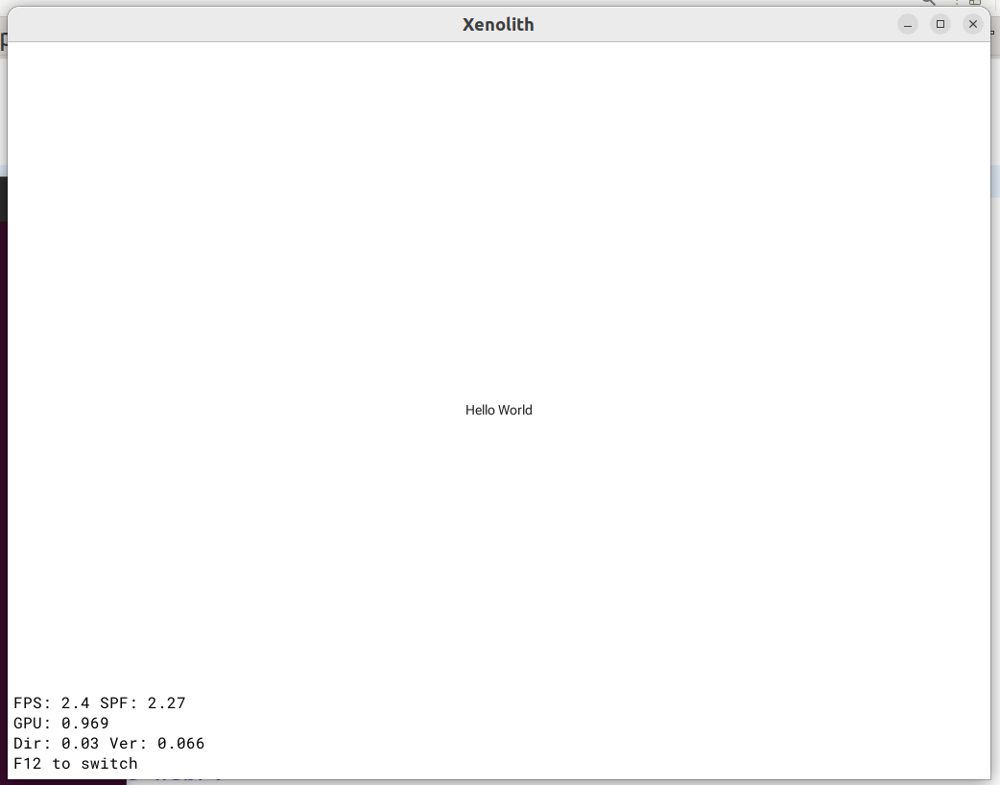

# Пример графического приложения с использованием Vulkan API

Приложение создаёт базовую графическую сцену и рисует её с помощью Vulkan API в окне ОС.

## Требования

Основные инструменты сборки: компиляторы C и C++, make. Установленные в системе средства [Vulkan или Vulkan SDK](https://github.com/libstappler/libstappler-doc/blob/master/docs-ru/other/vulkan.md).

## Структура

Makefile - Файл описания проекта
main.cpp - Точка входа
src/ExampleApplication.cpp - код запуска приложения
src/ExampleApplication.h - заголовок класса приложения
src/ExampleScene.cpp - код базовой сцены
src/ExampleScene.h - заголовок сцены

## Сборка

При использовании Vulkan SDK:

```
make VULKAN_SDK_PREFIX=<префикс платформы внутри SDK>
```

При системных средствах Vulkan:

```
make
make install
```

Успешная сборка выглядит так:

```
Build for x86_64
Build executable: stappler-build/host/debug/gcc/testapp
Enabled modules: xenolith_backend_vkgui xenolith_renderer_material2d stappler_build_debug_module xenolith_backend_vk xenolith_renderer_basic2d xenolith_renderer_basic2d_shaders xenolith_scene xenolith_font xenolith_application xenolith_platform xenolith_resources_icons xenolith_core stappler_threads stappler_font stappler_bitmap stappler_brotli_lib stappler_vg stappler_tess stappler_geom stappler_data stappler_filesystem stappler_core
Modules was updated
[glslangValidator] xl_2d_material.frag/main.frag
...
[testapp: 100% 29/29] [g++] main.o
[Link] stappler-build/host/debug/gcc/testapp
```

Готовое приложение будет расположено в `stappler-build/host/debug/gcc/testapp`

## Работа приложения

Приложение создаёт окно ОС (то есть, должно выполняться в системе с поддержкой графического вывода).

```
$ stappler-build/host/debug/gcc/testapp --help
testapp <options>
Options are one of:
	--w=<initial screen width in pixels>
	--h=<initial screen height in pixels>
	--d=<pixel density>
	--l=<application locale code>
	--bundle=<application bundle name>
	--renderdoc - try to connect with renderdoc capture layers
	--novalidation - force-disable vulkan validation
	--decor=<left,top,right,bottom> - view decoration padding in pixels
	-v (--verbose)
	-h (--help)
$ stappler-build/host/debug/gcc/testapp
```



## Android

Для запуска на Android нужно импортировать gradle проект из директории proj.android в Android Studio.

Объяснение, как работают приложения на Android [здесь](https://github.com/libstappler/libstappler-doc/blob/master/docs-ru/other/android.md#%D1%81%D0%BE%D0%B7%D0%B4%D0%B0%D0%BD%D0%B8%D0%B5-%D0%BF%D1%80%D0%B8%D0%BB%D0%BE%D0%B6%D0%B5%D0%BD%D0%B8%D1%8F-%D0%BD%D0%B0-android).

## Mac

Проект для XCode расположен в директории proj.macos.

Для создания нового проекта:

* Создать проект приложения в XCode
* Удалить автоматически созданный код
* Отключить ограничения пользовательских скриптов (Build Settings -> User Script Sandboxing -> No)
* Добавить пользовательский скрипт в Build Phases как можно раньше в списке. Содержимое скрипта: `make -C .. mac-export RELEASE=1` .. - заменить на путь от файла проекта XCode к Makefile проекта.
* Запустить сборку проекта (она провалится)
* Добавить в проект сгенерированный файл macos.projectconfig.xcconfig и назначить его конфигурацией для цели сборки (не проекта!) для Debug и Release
* Добавить в качестве подпроектов libstappler-root/core/proj.macos/core.xcodeproj и libstappler-root/xenolith/proj.macos/xenolith.xcodeproj
* Добавить в качестве зависимостей (Target Dependencies) цели libstappler-core и libstappler-xenolith
* Добавить библиотеки модулей (Link Binary With Libraries), требуемых приложением.
* Добавить исходный код проекта в XCode для сборки (Compile Sources)

Для добавления Vulkan:

* Добавить для копирования директорию libstappler-root/xenolith/proj.macos/vulkan (Copy Bundle Resources -> Add others)
* Добавить библиотеки в проект XCode из SDK: libMoltenVK.dylib, libVkLayer_khronos_validation.dylib, libvulkan.1.dylib, libvulkan.<SDKVER>.dylib (не добвлять их в цель в диалоге!)
* Добавить libMoltenVK.dylib, libvulkan.1.dylib, libvulkan.<SDKVER>.dylib в General -> Frameworks, Libraries and Embedded Content (нужно нажать + -> Add others)
* В Build Phases -> Embed Libraries добавить libVkLayer_khronos_validation.dylib

Для портируемости проекта в git:

* Открыть файл проекта в текстовом редакторе (*.xcodeproj -> Показать содержимое пакета -> project.pbxproj)
* Заменить абсолютные пути, начинающиеся с /Users на относительные
